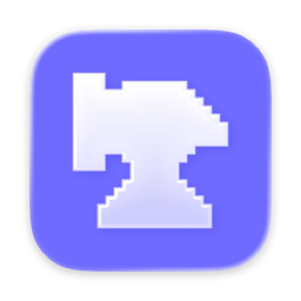

<div align="center">



# Anvil

**One place to build and run everything.**

A native macOS app that centralizes your mobile and dev builds — iOS, Android, Bun/npm and Docker — behind a single, beautiful blueprint interface. Pick a project, choose a scheme / flavor / simulator / device, hit **Build** or **Run**. No memorizing `xcodebuild`, `gradlew`, `docker compose` flags.

[](#requirements)
[](#tech-stack)
[](LICENSE)
[](CONTRIBUTING.md)

</div>

---

## What is Anvil?

Every project has its own incantation. iOS wants `xcodebuild -scheme … -destination …`. Android wants `./gradlew assembleProdDebug`. A web service wants `bun run dev`. A container wants `docker compose up`. Anvil is the workbench that holds all of them.

You add a folder, Anvil **detects what kind of project it is**, discovers its schemes / flavors / scripts / services, and gives you one consistent panel to build and run — with a **live log console** and a **live CPU & memory waveform** so you can watch what the build is doing to your machine.

The interface is a **cyanotype blueprint**: dark blue paper, white line art, everything drawn on screen as if traced by a pen.

## Features

- 🔨 **Four toolchains, one panel** — iOS (`xcodebuild`), Android (`gradlew`), Bun/npm (`bun`/`npm run`), and Docker (`docker compose` / `docker build`).
- 🔎 **Automatic detection** — drop in a folder and Anvil figures out the platform(s) and discovers schemes, flavors, npm scripts and compose services.
- 📱 **Real iOS Run** — full build → install → launch pipeline on the Simulator via `simctl`.
- 📜 **Live build console** — stdout/stderr streamed in real time, color-coded.
- 📈 **Live telemetry** — CPU and memory of the build's process tree drawn as an oscilloscope waveform.
- 🧩 **Projects as containers** — a project groups multiple components, each with its own Build / Run / Stop controls.
- 🎚️ **Native pickers** — choose scheme, flavor, simulator, device, environment from clean white blueprint dropdowns.
- 🪧 **Menu bar extra** — trigger builds for any project/component without opening the window.
- ✏️ **Drawn-in animations** — SVG path-by-path tracing, plotter-style reveals, a live Metal blueprint field.

## Screenshots

> Drop your screenshots into [`docs/screenshots/`](docs/screenshots/) and they'll show up here.

| Empty state | Project blueprint | Build running |
|:---:|:---:|:---:|
| _add `docs/screenshots/empty.png`_ | _add `docs/screenshots/project.png`_ | _add `docs/screenshots/build.png`_ |

## Requirements

- **macOS 26 (Tahoe)** or later
- **Xcode 26.3** or later (to build from source)
- The toolchains you intend to drive, on your `PATH`: Xcode command-line tools, Android SDK + Gradle wrapper, [Bun](https://bun.sh) or Node, and/or [Docker](https://www.docker.com).

> **Note on the sandbox.** Anvil spawns `xcodebuild`, `gradlew`, `bun`, `docker` and `simctl` on your behalf, so the **App Sandbox is intentionally disabled** (Hardened Runtime stays on). This is why Anvil is distributed as source / a local `.dmg` rather than through the Mac App Store.

## Getting started

```bash
git clone https://github.com/rodniski/anvil.git
cd anvil
open anvil.xcodeproj
```

Then in Xcode: select the **anvil** scheme and press **⌘R**.

Prefer the command line?

```bash
xcodebuild -project anvil.xcodeproj -scheme anvil \
  -configuration Debug -destination 'platform=macOS' build
```

Prefer not to build? Grab a pre-built **`Anvil.dmg`** from the [Releases](https://github.com/rodniski/anvil/releases) page.

### First run

1. Click **+ projeto** in the sidebar and name your project.
2. Inside the project, **Adicionar componente** and point Anvil at a folder.
3. Anvil detects the platform, discovers its targets, and you're ready to **Build** / **Run**.

## Architecture

Anvil keeps a clean split between a **headless orchestration engine** (testable, no SwiftUI) and the **SwiftUI layer**.

```
anvil/
├─ Engine/                  # orchestration — pure, testable, no UI
│  ├─ Project.swift         # models: Project, Component, Platform, Selection
│  ├─ ProjectDetector.swift # what kind of project lives in this folder?
│  ├─ SchemeDiscovery.swift # schemes · flavors · npm scripts · compose services
│  ├─ BuildRunner.swift     # builds the concrete command for each platform
│  ├─ ProcessRunner.swift   # subprocess streaming via AsyncThrowingStream
│  ├─ IOSLauncher.swift     # build → install → launch through simctl
│  ├─ ResourceSampler.swift # system CPU + process-tree RSS sampling
│  ├─ DeviceCatalog.swift   # simulators / emulators / Xcode installs
│  └─ ProjectStore.swift    # persistence
│
├─ AnvilApp.swift           # @main · WindowGroup · MenuBarExtra
├─ AppModel.swift           # @Observable @MainActor app state
├─ ContentView.swift        # NavigationSplitView · sidebar · empty state
├─ ProjectBlueprint.swift   # the project "plate" + per-component blocks
├─ LaneView.swift           # status badge · blueprint dropdown · build waveform
├─ Theme.swift              # the cyanotype palette + font registration
├─ DrawIn.swift             # draw-in wipes · double borders · loaders
├─ SVGPath.swift            # SVG parser + path-by-path trace animation
└─ AnvilMark.swift          # Metal blueprint field + grid
```

Because the engine doesn't import SwiftUI, build-command construction is verified by inspection (no processes spawned) in the test target.

## Tech stack

- **SwiftUI** with `@Observable` / `@MainActor` state
- `TimelineView` + `Canvas` for the live telemetry waveform
- A **Metal** fragment shader for the breathing blueprint field
- `Shape` + `.trim` / `trimmedPath` for path-by-path "pen drawing"
- `Process` + `AsyncThrowingStream` for real-time subprocess streaming
- `host_statistics` (CPU) and `ps` (process-tree memory) for telemetry
- `MenuBarExtra` for the status-bar controls

## Design philosophy

Anvil is a **living blueprint**, not a literal anvil. Cyanotype paper (`#0E2F63`), pure-white line art, [Fraunces](https://fonts.google.com/specimen/Fraunces) for headings and [Londrina Outline](https://fonts.google.com/specimen/Londrina+Outline) for the wordmark. Nothing just *appears* — it gets **drawn**, traced stroke by stroke, the way a plotter would render a technical diagram.

## Roadmap

- [ ] Per-service Docker controls (`up` / `down` / `ps` status)
- [ ] Physical Android device + iOS device runs
- [ ] Developer ID signing & notarization for distributable builds
- [ ] `make release` script to regenerate the `.dmg`
- [ ] Persisted build history per component

## Contributing

Contributions are welcome — see [CONTRIBUTING.md](CONTRIBUTING.md).

## License

[MIT](LICENSE) © Guilherme Rodniski

## Credits

- Fonts: **Fraunces** and **Londrina Outline** (Google Fonts, OFL).
- The traced engraving in the empty state is derived from a public-domain anvil patent illustration.
</content>
</invoke>
